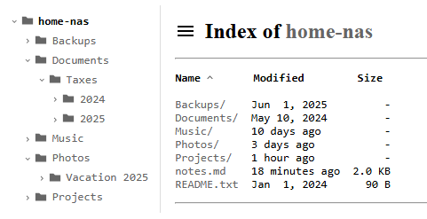

# autoindex

A small file listing server in Go, styled after nginx's `autoindex` but
with some improvements:
- Human-readable sizes and times
- Sortable columns
- Mobile-friendly
- Directory tree listing (styled after [h5ai](https://github.com/lrsjng/h5ai))

No dependencies and no external JavaScript.



## Build and run

```
go build -o autoindex .
./autoindex -root /path/to/files -port 8080
```

Or without building: `go run . -root /path/to/files`.

Then open http://localhost:8080/.

## Flags

| Flag    | Default | Description                        |
|---------|---------|------------------------------------|
| `-root` | `.`     | Directory to serve                 |
| `-port` | `8080`  | Port to listen on                  |
| `-all`  | `false` | Show dotfiles (hidden by default)  |
| `-hostname` | (Host header) | Hostname to display instead of the request's |
| `-tree` | `false` | Enable the folder tree sidebar     |

## Docker

```
docker build -t autoindex .
docker run --rm -p 8080:8080 -v /path/to/files:/data:ro autoindex
```

The image serves `/data` on port 8080. Extra flags go after the image name,
e.g. `docker run ... autoindex -tree`.

With Docker Compose, edit the volume path in `compose.yaml`, then:

```
docker compose up -d
```
