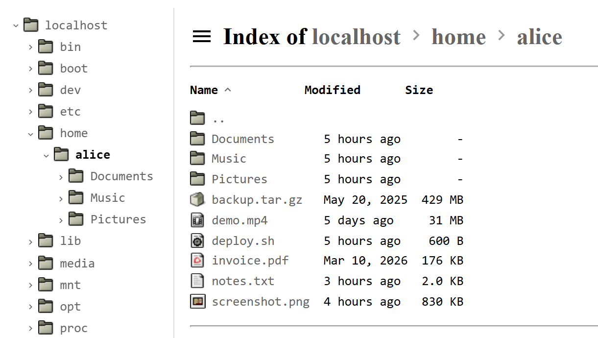

# autoindex

A small file listing server in Go, styled after nginx's `autoindex` but
with some improvements:
- Human-readable timestamps
- Sortable columns
- Mobile-friendly
- Directory tree listing (styled after [h5ai](https://github.com/lrsjng/h5ai))
- Filetype icons



## Build and run

```
go build -o autoindex .
./autoindex /path/to/files -p 8080
```

Or without building: `go run . /path/to/files`. The directory to serve is a
positional argument and defaults to `.` when omitted.

Then open http://localhost:8080/.

## Flags

| Flag | Short | Default | Description                        |
|------|-------|---------|------------------------------------|
| `--port` | `-p` | `8080`  | Port to listen on                  |
| `--all`  | `-a` | `false` | Show dotfiles (hidden by default)  |
| `--hostname` | `-H` | (Host header) | Hostname to display instead of the request's |
| `--tree` | `-t` | `false` | Enable the folder tree sidebar     |
| `--icons` | `-i` | `false` | Show filetype icons in the listing |
| `--human-readable` | `-h` | `false` | Show modification times as relative ("3 hours ago") instead of absolute |

## Docker

```
docker build -t autoindex .
docker run --rm -p 8080:8080 -v /path/to/files:/data:ro autoindex
```

The image serves `/data` on port 8080 (the directory is fixed via the image's
entrypoint). Extra flags go after the image name, e.g. `docker run ... autoindex --tree`.

## Licensing

With `-icons`, file/folder icons come from the old GNOME 2 desktop icon theme
(https://www.gnome.org), licensed GPL-2.0-or-later - not the MIT license the
rest of this project is under (see [LICENSE](LICENSE)). The icon PNGs live
under `web/icons/`.
